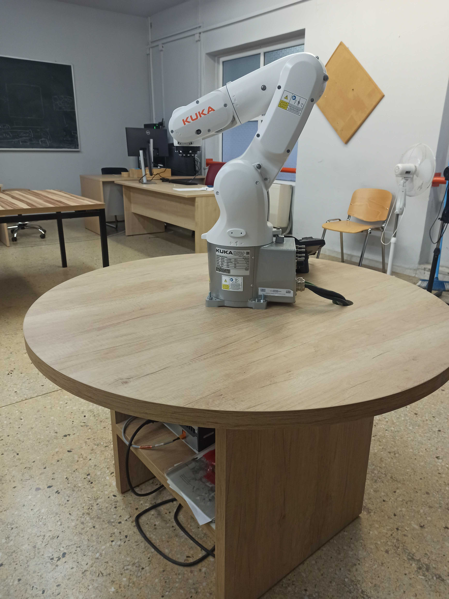

# Kuka Package

Kuka package for kr4r600 robot arm located in Duth LRA lab
<!--  -->


Requirements :
Install Ubuntu 18.04 - ROS melodic 

Create a catkin workspace following the intructions: [catkin workspace](http://wiki.ros.org/catkin/Tutorials/create_a_workspace)

Make sure that you have added the following lines at the end of your ~/.bashrc file:
```
source /opt/ros/melodic/setup.bash
source ~/catkin_ws/devel/setup.bash
```
Go to your ~/catkin_ws/src path:
```
$ cd ~/catkin_ws/src/
```
Add clone the following packages:
```
$ https://github.com/duth-lra/kuka_lra/
$ https://github.com/koikonomou/kuka_experimental

```
Follow the next commands to intall the packages :
```
$ cd ..
```
```
$ sudo rosdep init
$ rosdep update
$ rosdep install --from-paths src --ignore-src -r -y
```
```
$ catkin_make
```


In order to launch the basic file that open rviz and gazebo simulation on a table with a box run:

```
roslaunch kuka_gazebo kuka_gazebo.launch
```
